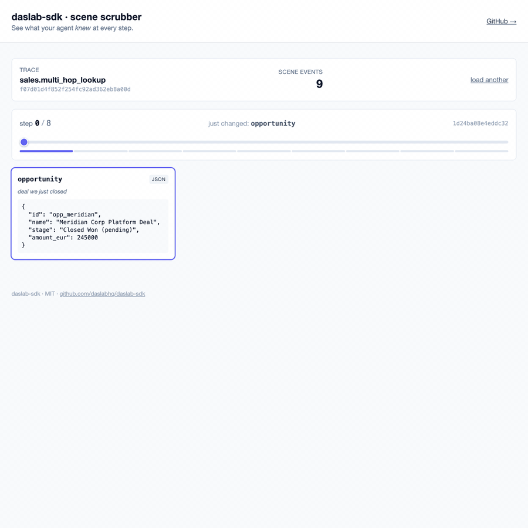

# scene-otel

> Snapshot what your agent knew, at every step.

`scene.set(key, value)` emits an OTel span event with a content-addressed snapshot of the value. Whatever sink you have configured — Phoenix, Braintrust, Honeycomb, Datadog, Jaeger, JSONL, Daslab — sees it.



*Above: an agent run rendered in the static scrubber. Each step's snapshot of the world state — inbox, flagged count, draft, etc. — surfaces inline so you can see what the agent knew, not just what it did.*

**Try it live →** <https://daslabhq.github.io/scene-otel/>

> **Where things live.** `scene-otel` is the **wire format** — `scene.set` events, hashing, diff, and a generic scrubber. Typed canonical asset shapes (Email, Message, Calendar, …) and the multi-format renderer live in [`scene-views`](https://github.com/daslabhq/scene-views). Adapters for specific benchmarks (AutomationBench, τ-bench, LeRobot) and bench-scoped vendor types (Gmail, Salesforce, Slack) live in [`scene-bench`](https://github.com/daslabhq/scene-bench).

## Install

```bash
npm install scene-otel @opentelemetry/api
```

## Use

```ts
import { scene } from "scene-otel";

scene.set("inbox",   emails);          // → table
scene.set("flagged", flagged.length);  // → metric
scene.set("draft",   draft);           // → text/json (auto-inferred)
```

Each call adds an event named `scene.set` to the active OTel span. The widget hint is inferred from the value's shape; override with `{ as }`.

## What you can do with the events

- **Read them in any OTel viewer.** Span events render inline in Phoenix, Braintrust, Honeycomb, Datadog, Jaeger, etc. Trace becomes legible: not just "LLM call → tool call → done" but "after step 3, inbox=47, flagged=3, draft drafted."
- **Replay deterministically.** Every snapshot is content-hashed. Two runs with the same inputs produce the same hashes — useful for confirming reproducibility.
- **Diff between runs.** `sceneDiff(before, after)` (see below) returns added / removed / changed / unchanged keys with deep equality.
- **Share traces.** A JSONL dump is enough to reproduce a failure off-system.
- **Use them as labeled trajectories.** Each `scene.set` is a content-addressed step output, which is the shape Verifiers / RL training expects.

## API

```ts
scene.set("inbox", emails);

// Override inferred type
scene.set("notes", "raw text", { as: "text" });

// Document the key (helps coding-agent readers + UIs)
scene.set("budget", 12_000, { description: "EUR remaining" });

// Atomically commit several keys under one hash
scene.set("a", 1);
scene.set("b", 2);
scene.commit();
```

### Wire format

Each `scene.set` adds an event named `scene.set` to the current OTel span:

| Attribute | Meaning |
|---|---|
| `scene.key` | The user-supplied key |
| `scene.commit_hash` | sha256 over canonical batch JSON, 16-char hex |
| `scene.value` | JSON-encoded value (truncated at 32 KB) |
| `scene.value.type` | Widget hint: `table` / `metric` / `text` / `image` / `list` / `json` |
| `scene.value.size` | JSON byte size |
| `scene.description` | Optional |

The contract is plain OTel — no daslab-specific consumer needed.

### Inferred types

| Value shape | Type |
|---|---|
| `[{...}, {...}]` (array of objects with consistent keys) | `table` |
| `42` (number) | `metric` |
| `"hello"` (string) | `text` |
| `[1, 2, 3]` (array of primitives) | `list` |
| `{ url: "x.png" }` or `{ mimeType: "image/..." }` | `image` |
| anything else | `json` |

## Diff

```ts
import { sceneDiff, buildSnapshot } from "scene-otel";

const before = buildSnapshot(events, "ab12cd34ef567890");  // commit_hash
const after  = buildSnapshot(events, "ff99ee88aa776655");
const d = sceneDiff(before, after);
//  {
//    added:    { draft: {...} },
//    removed:  {},
//    changed:  [ { key: "flagged", before: 0, after: 2 } ],
//    unchanged: ["inbox", "budget"]
//  }
```

Useful for: comparing two prompts on the same input, detecting belief drift mid-run, surfacing what a single tool call mutated.

## Static scrubber

A single HTML file under [`viewer/`](./viewer) parses JSONL OTel traces and renders the scene timeline as scrubbable cards (table / metric / text / image / json). No build step.

Live: <https://daslabhq.github.io/scene-otel/> · or run locally:

```bash
cd viewer
python3 -m http.server 5173
# http://localhost:5173
```

Five synthetic agent runs are bundled — generic substrate examples (sales, support, marketing, HR, gmail-triage). Looking for AutomationBench traces, schemas, or task dumps? They live in [`scene-bench`](https://github.com/daslabhq/scene-bench) — the harness wraps Sierra's Verifiers env, syncs the 49 typed JSON Schemas + 806 tasks, and ships the JSONL fixtures.

## Daslab platform

This SDK is the substrate behind [daslab.dev](https://daslab.dev) — a platform for running, observing, and iterating on agents end-to-end with persistent multi-platform scene viewing (iOS / desktop / web), cross-run queries, and RL training on the resulting trajectories. The SDK works fully standalone; the platform is what we're building on top of it.

## Roadmap

v0.0.6 (current)

- ✅ `scene.set / commit / pending`, auto widget-type inference, content hashing, graceful no-op
- ✅ `sceneDiff` + `buildSnapshot`
- ✅ Static HTML scrubber + 5 synthetic fixtures, hosted on Pages

Coming next

- `defineScene({ key, schema })` — typed scene declarations with JSON Schema validation
- Tighter integration with [`scene-views`](https://github.com/daslabhq/scene-views) views and [`scene-bench`](https://github.com/daslabhq/scene-bench) bench fixtures

## License

MIT. See [LICENSE](./LICENSE).

## Related

- [`scene-views`](https://github.com/daslabhq/scene-views) — typed canonical asset shapes (Email, Message, Calendar, …) + sized views that render to HTML / Markdown / Text. The visual language for everything `scene-otel` emits.
- [`scene-bench`](https://github.com/daslabhq/scene-bench) — open harness for running, measuring, and visualizing agent benchmarks. Adapters for AutomationBench, τ-bench, LeRobot, …
- [`agent-otel`](https://github.com/mirkokiefer/agent-otel) — the OTel router for agent telemetry. Fanout to any sink.
- [`scry`](https://github.com/mirkokiefer/agent-otel#scry--sdk-and-cli-for-agents-to-query-their-own-traces) — SDK + CLI for agents to query their own traces. Bundled with `agent-otel`.
- [`autocompile`](https://github.com/mirkokiefer/autocompile) — observes repeated agent runs and compiles the invariant parts into code, leaving the LLM only the decisions that need judgment.
